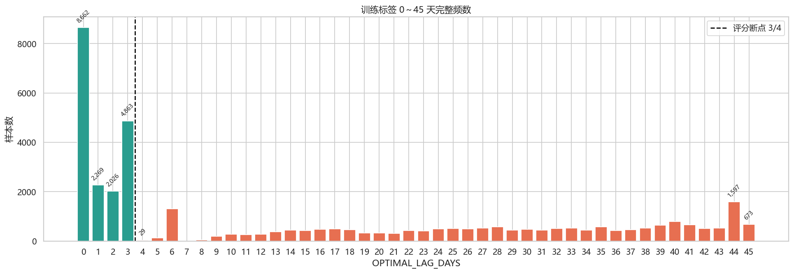
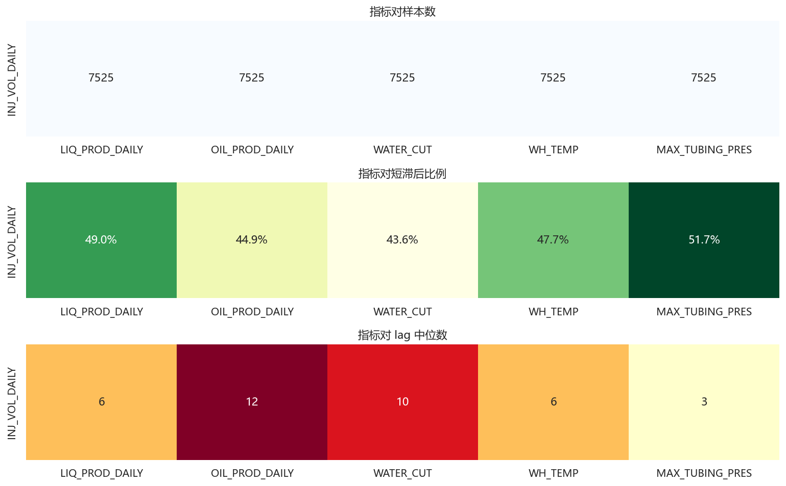
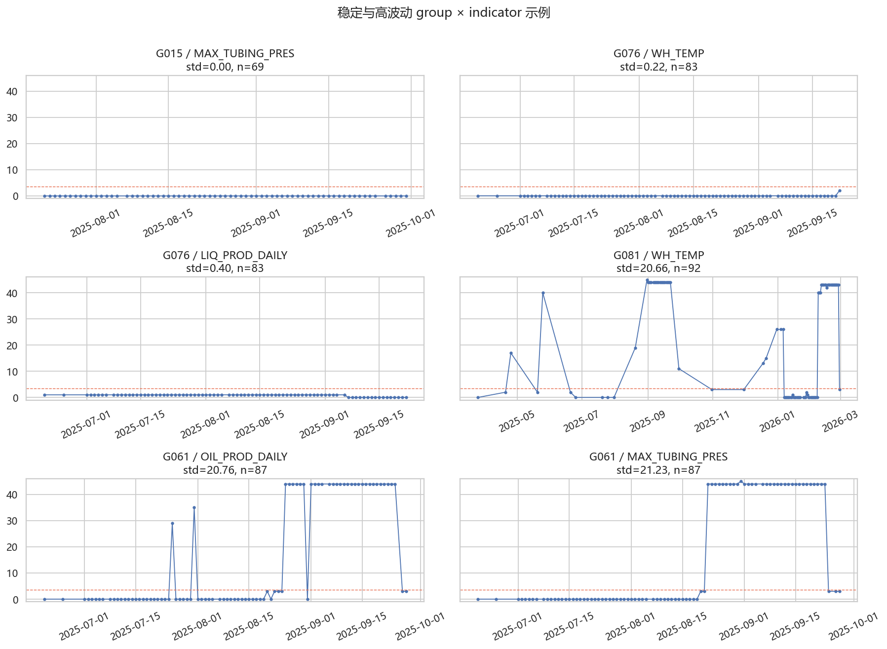
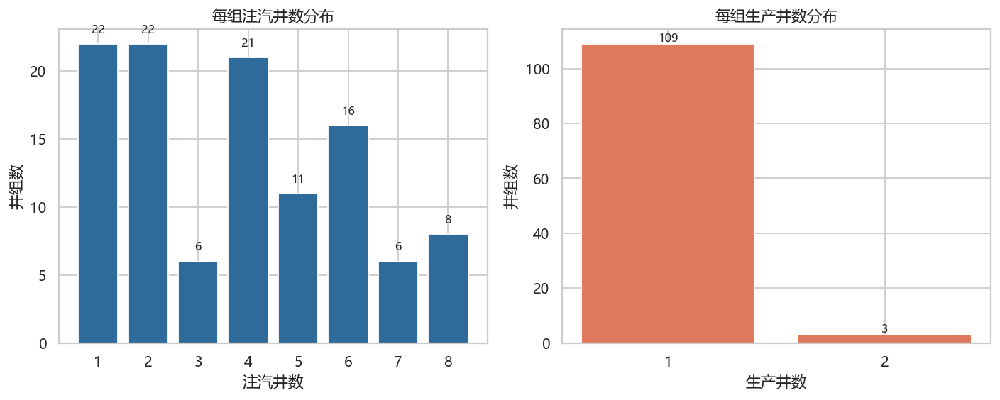
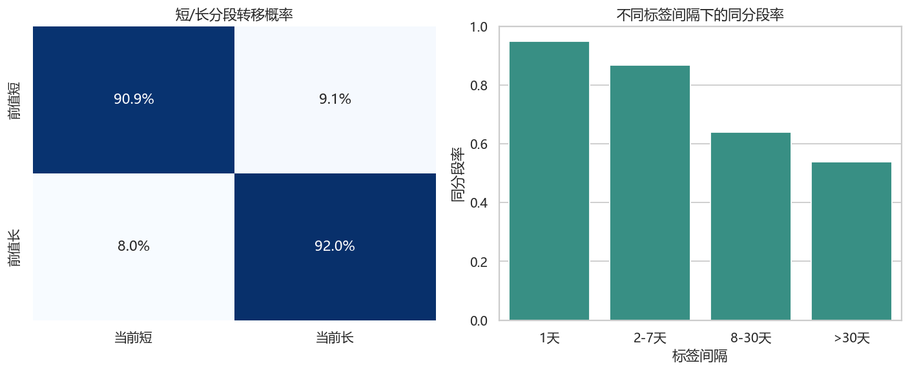
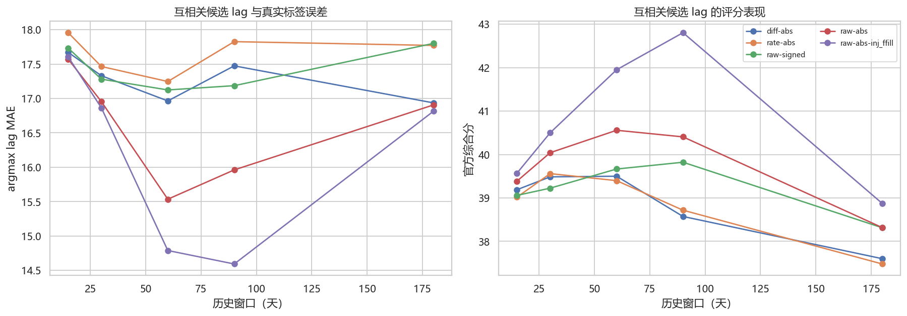
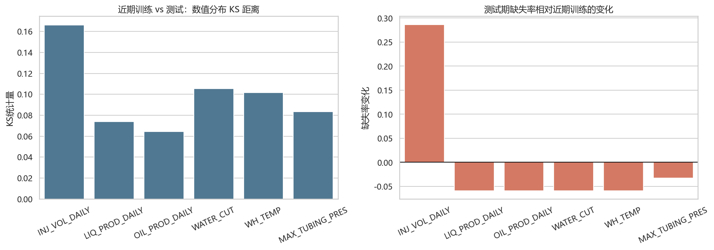

# 浅层超稠油注采响应滞后 EDA 总览

## 分析目标

本次 EDA 围绕三件事展开：训练样本的历史信息边界、井组多井时序的聚合方式、训练期到未来测试期的分布变化。分析覆盖四张源表、官方标签结构、简单参照规则的评分诊断和因果历史互相关探测。这里的简单参照规则没有训练模型，也没有生成测试集预测。

## 核心判断

| 问题                         | EDA答案                                                                                                                                                      |
|:-----------------------------|:-------------------------------------------------------------------------------------------------------------------------------------------------------------|
| 一个训练样本由哪些信息决定？ | 标签键是井组×日期×注入指标×采出指标；当前只有1个注入指标、5个采出指标。应使用该日期以前的井级/井组级动态、静态拓扑、缺失状态和指标类别。                     |
| 井组时序如何聚合？           | 多数为1P+多I。注汽量、产液、产油以sum为主；比例做加权；温压保留mean/max/std；所有指标保留有效井数与缺失特征。                                                |
| 训练与未来测试如何变化？     | 33个测试井组中32个已见，但数值分布和缺失率发生漂移；测试初期需要训练末期历史；新井组仅占约0.09%。                                                            |
| 这是记忆题还是lag估计题？    | group×indicator存在稳定先验，局部标签自相关很强，但多步外推简单规则的得分明显下降，朴素互相关也不能充分复现标签。因此是井组先验与时变lag信号并存的混合问题。 |

## 最关键的三张结果

### 1. 0～45 天完整标签频数

### 2. 指标对样本数、short 比例和 median lag

### 3. 同一 group × indicator 的标签时间变化

## 额外关键结果

### 井组拓扑

### 标签局部转移

### 互相关窗口实验

### 未来分布漂移

## 阅读顺序

1. [井组结构与数据关系](01_井组结构与数据关系.md)
2. [注汽时序与缺失](02_注汽时序与缺失.md)
3. [采出时序与缺失](03_采出时序与缺失.md)
4. [标签指标对与井组效应](04_标签指标对与井组效应.md)
5. [标签时间行为与简单参照规则](05_标签时间行为与评分基线.md)
6. [聚合方式与互相关实验](06_聚合方式与互相关实验.md)
7. [时间漂移与训练测试关系](07_时间漂移与训练测试关系.md)
8. [EDA 结论与建模约束](08_EDA结论与建模约束.md)

## 可复现性

- 原始数据未修改。
- 数值明细表保存在 [`tables`](tables)。
- PNG 图表保存在 [`figures`](figures)。
- [`run_eda.py`](run_eda.py) 可一键重建全部分析。
