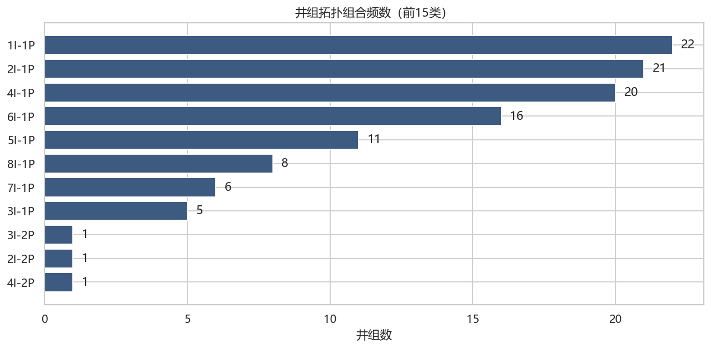
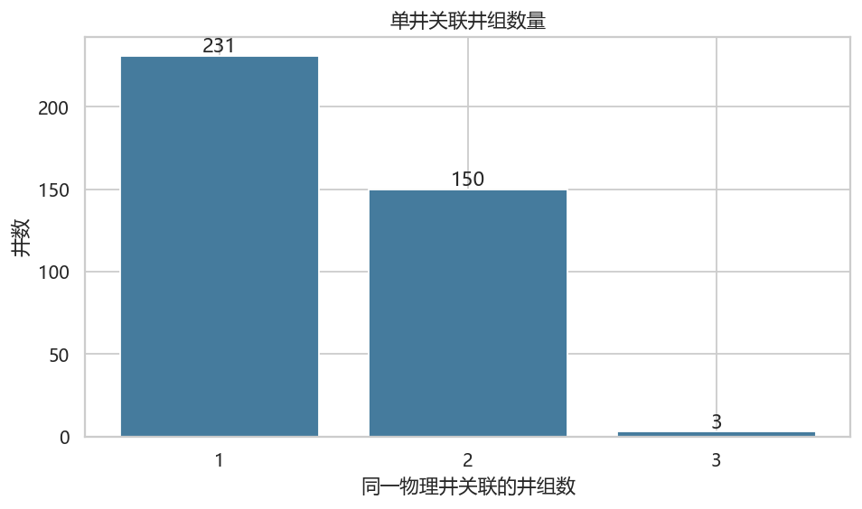
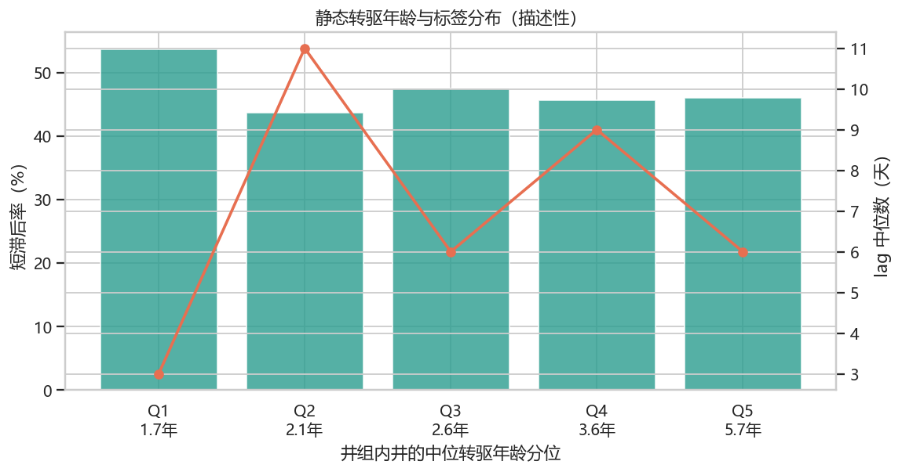

# 井组结构与数据关系 EDA

## 结论

- 静态主表有 **112 个井组、384 口唯一井、540 条井组—井关系**。
- 井组关系中有 **425 条注汽井关系**、**115 条生产井关系**。平均每组 3.79 口注汽井、1.03 口生产井。
- 生产侧拓扑很简单：109 个井组为单生产井，只有 3 个井组为多生产井；生产井数最大为 2。注汽侧更复杂，注汽井数范围为 1～8。
- 153 口井关联多个井组，最多关联 3 个井组。不能按物理井名全局去重。
- 训练和测试的 `well_group_info.csv` 完全一致：**True**。`CANTON` 是常量；`ORG_NAME` 与 `BLOCK` 只有两个完全对应的组合；静态 `PROD_DATE` 全部为 2026-01-11，不具备横截面区分度。

## 图表

## 拓扑组合频数

| 拓扑   |   井组数 |
|:-------|---------:|
| 1I-1P  |       22 |
| 2I-1P  |       21 |
| 4I-1P  |       20 |
| 6I-1P  |       16 |
| 5I-1P  |       11 |
| 8I-1P  |        8 |
| 7I-1P  |        6 |
| 3I-1P  |        5 |
| 4I-2P  |        1 |
| 2I-2P  |        1 |

完整井组拓扑见 [`tables/well_group_topology.csv`](tables/well_group_topology.csv)，完整组合频数见 [`tables/topology_counts.csv`](tables/topology_counts.csv)。

## 文件级结构审计

| 数据集   | 文件                      |   行数 |   列数 |   完全重复行 |   唯一WELL_GROUP_NAME |   唯一WELL_NAME |   唯一PROD_DATE |
|:---------|:--------------------------|-------:|-------:|-------------:|----------------------:|----------------:|----------------:|
| train    | well_group_info.csv       |    540 |     10 |            0 |                   112 |         384.000 |               1 |
| train    | well_inj_data.csv         |  56280 |      7 |            0 |                   108 |         237.000 |             365 |
| train    | well_prod_data.csv        |  80443 |      8 |            0 |                   112 |         242.000 |             363 |
| train    | optimal_lag_days.csv      |  37625 |      5 |            0 |                   108 |         nan     |             223 |
| test     | well_group_info.csv       |    540 |     10 |            0 |                   112 |         384.000 |               1 |
| test     | well_inj_data.csv         |   4408 |      7 |            0 |                    42 |          32.000 |              92 |
| test     | well_prod_data.csv        |  14996 |      8 |            0 |                   112 |         138.000 |              92 |
| test     | test_optimal_lag_days.csv |  11020 |      5 |            0 |                    33 |         nan     |              77 |

## 对后续特征工程的约束

1. 绝大多数井组属于“一口生产井 + 多口注汽井”，生产侧总量与单井量在多数井组接近，但仍要保留多生产井的聚合口径。
2. 注汽侧必须保留总量、最大单井量、井间离散度和有效井数，仅取均值会丢失井组规模。
3. `WELL_PURPOSE` 与动态文件并非完全一致，可能与转驱或历史用途有关，不应仅凭静态用途硬过滤动态记录。
4. 静态年龄与标签图只表示相关关系。年龄与井组、区块、开发阶段共同变化，不能直接解释为因果。
