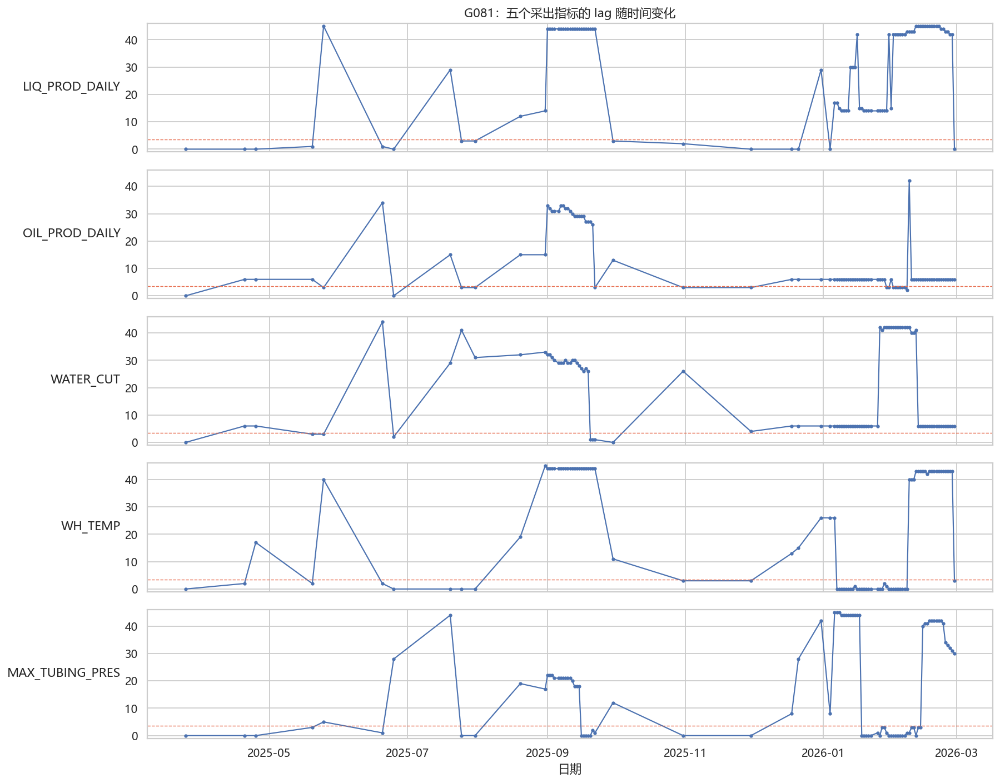
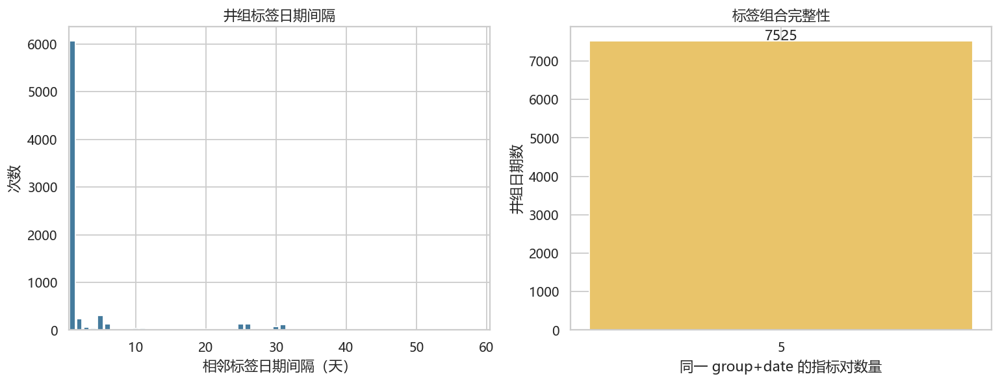
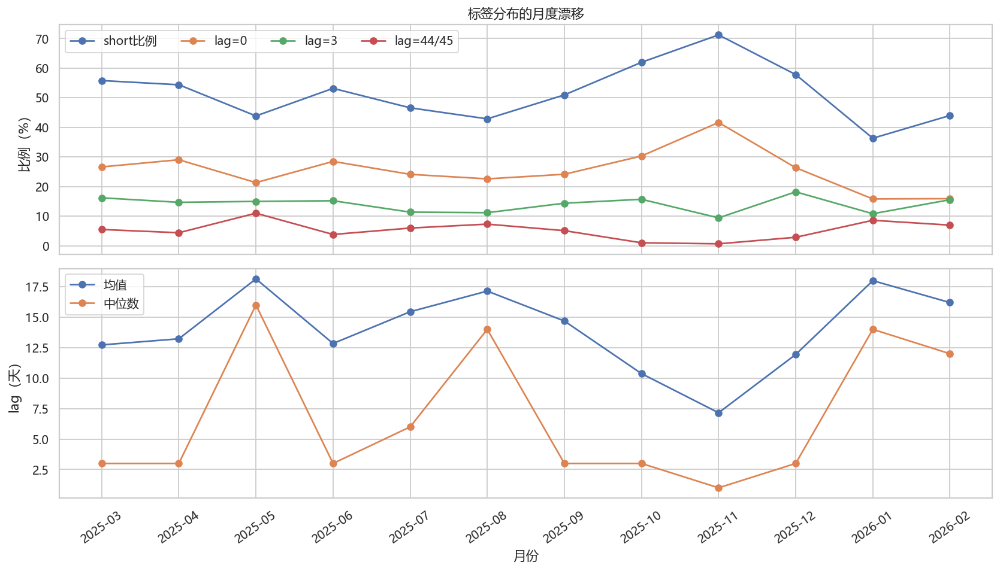
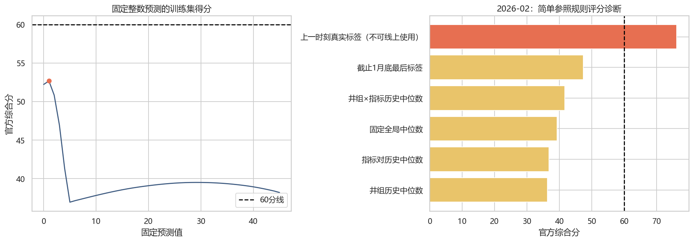
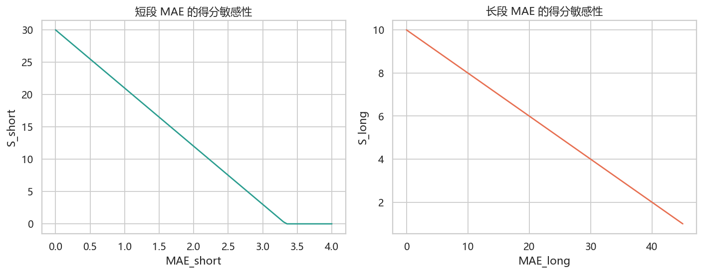

# 标签时间行为、生成频率与简单参照规则 EDA

## G081 与代表性时间序列

图中横线是 3/4 天评分断点。可见不同生产指标的状态转换并不同步，不能把同一井组日期的五个标签复制为一个值。

## 标签自相关与状态切换

- 相邻可用标签完全相同率：**70.56%**。
- 相邻标签处于同一短/长分段的比例：**91.48%**。
- 相邻标签绝对变化中位数：0.0 天；均值：3.19 天。

| gap_bucket   |   相邻对数 |   lag完全相同率 |   同分段率 |   中位绝对变化 |   平均绝对变化 |
|:-------------|-----------:|----------------:|-----------:|---------------:|---------------:|
| 1天          |      30325 |           0.774 |      0.949 |          0.000 |          1.948 |
| 2-7天        |       3875 |           0.533 |      0.868 |          0.000 |          5.133 |
| 8-30天       |       2170 |           0.237 |      0.640 |          6.000 |         13.114 |
| >30天        |        715 |           0.176 |      0.540 |         11.000 |         15.450 |

## 标签日期生成频率

- 每个进入标签表的 `group + date` 固定有 **5** 条指标对记录，训练集 7,525 个井组日期全部完整。
- 相邻标签日期的中位间隔为 1 天，但最大间隔达到 158 天，样本并非独立同分布的等间隔观测。

## 月度标签漂移

| 月份    |   样本数 |   井组数 |   short比例 |   平均lag |   中位lag |   lag0比例 |   lag3比例 |   lag44_45比例 |
|:--------|---------:|---------:|------------:|----------:|----------:|-----------:|-----------:|---------------:|
| 2025-03 |      785 |       94 |       0.558 |    12.725 |     3.000 |      0.266 |      0.162 |          0.055 |
| 2025-04 |      730 |       84 |       0.544 |    13.223 |     3.000 |      0.290 |      0.147 |          0.044 |
| 2025-05 |      755 |       87 |       0.438 |    18.139 |    16.000 |      0.213 |      0.150 |          0.110 |
| 2025-06 |      790 |       90 |       0.532 |    12.839 |     3.000 |      0.285 |      0.152 |          0.038 |
| 2025-07 |     8000 |      103 |       0.466 |    15.446 |     6.000 |      0.241 |      0.114 |          0.060 |
| 2025-08 |     7725 |      100 |       0.429 |    17.139 |    14.000 |      0.226 |      0.112 |          0.073 |
| 2025-09 |     7375 |       94 |       0.510 |    14.685 |     3.000 |      0.241 |      0.144 |          0.051 |
| 2025-10 |     1320 |       78 |       0.620 |    10.369 |     3.000 |      0.303 |      0.157 |          0.010 |
| 2025-11 |     1095 |       31 |       0.712 |     7.155 |     1.000 |      0.416 |      0.094 |          0.006 |
| 2025-12 |     1055 |       32 |       0.578 |    11.938 |     3.000 |      0.264 |      0.182 |          0.028 |
| 2026-01 |     3740 |       30 |       0.363 |    17.993 |    14.000 |      0.158 |      0.108 |          0.086 |
| 2026-02 |     4255 |       31 |       0.440 |    16.198 |    12.000 |      0.159 |      0.155 |          0.070 |

## 用官方公式评价 EDA 简单参照规则

> **范围说明：** 本节没有训练任何机器学习模型，也没有预测正式测试集。这里计算的是几条最简单的统计规则，用来判断标签仅靠总体分布、井组记忆或时间持续性能达到什么水平。它们属于 EDA 的可预测性诊断，不是正式模型基线，更不是比赛提交结果。“上一时刻真实标签”还使用了验证期真实值，只代表局部自相关的诊断上限，线上无法使用。

2026 年 2 月多步时间外推结果：

| 预测规则                         |   样本数 |   分段准确率 |   S_seg |   MAE_short |   S_short |   MAE_long |   S_long |   总分 |
|:---------------------------------|---------:|-------------:|--------:|------------:|----------:|-----------:|---------:|-------:|
| 井组历史中位数                   |     4255 |        0.501 |  30.078 |       9.326 |     0.000 |     18.886 |    6.223 | 36.300 |
| 指标对历史中位数                 |     4255 |        0.516 |  30.980 |       5.626 |     0.000 |     21.290 |    5.742 | 36.722 |
| 固定全局中位数                   |     4255 |        0.560 |  33.603 |       4.499 |     0.000 |     21.760 |    5.648 | 39.251 |
| 井组×指标历史中位数              |     4255 |        0.585 |  35.126 |       9.841 |     0.000 |     17.359 |    6.528 | 41.654 |
| 截止1月底最后标签                |     4255 |        0.676 |  40.541 |       8.127 |     0.000 |     16.021 |    6.796 | 47.336 |
| 上一时刻真实标签（不可线上使用） |     4255 |        0.928 |  55.657 |       2.098 |    11.120 |      3.157 |    9.369 | 76.146 |

“上一时刻真实标签”使用了验证期内已经发生的真实标签，只是局部持续性的诊断上限，测试时不可用。正式验证应固定在预测起点，只使用起点以前的标签和动态数据做完整多步外推。
