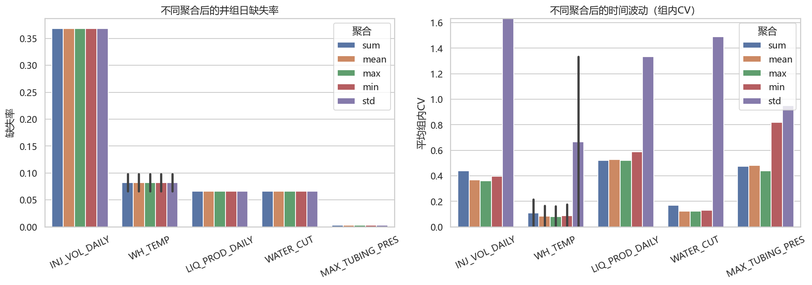
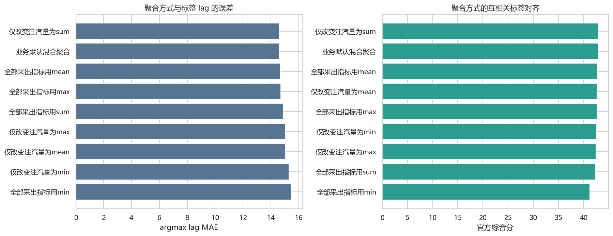
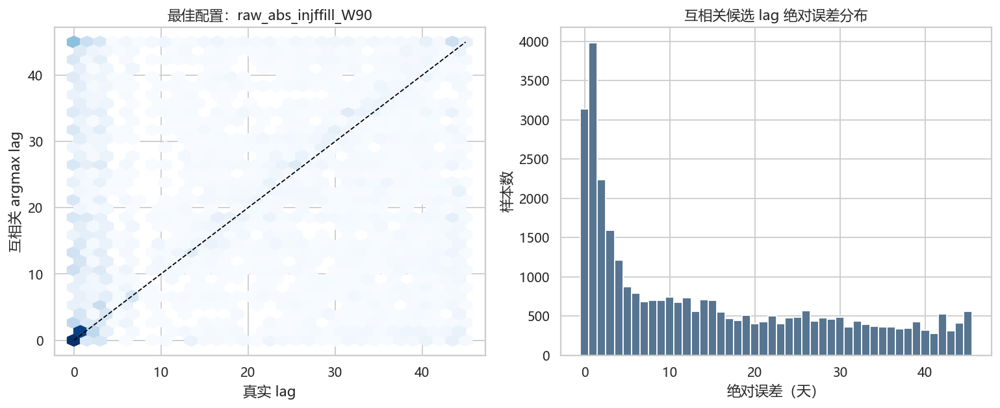

# 井组聚合方式与滞后互相关 EDA

## 聚合方式比较

完整表格：[`tables/aggregation_stability.csv`](tables/aggregation_stability.csv)。

| 方案               |   有效覆盖率 |   有效样本MAE |   有效样本分段准确率 |   有效样本官方分 |   缺失回退后官方分 |
|:-------------------|-------------:|--------------:|---------------------:|-----------------:|-------------------:|
| 业务默认混合聚合   |        0.875 |        14.593 |                0.613 |           44.217 |             42.806 |
| 仅改变注汽量为sum  |        0.875 |        14.593 |                0.613 |           44.217 |             42.806 |
| 全部采出指标用mean |        0.875 |        14.688 |                0.612 |           44.102 |             42.704 |
| 仅改变注汽量为mean |        0.875 |        15.059 |                0.611 |           44.050 |             42.658 |
| 全部采出指标用max  |        0.875 |        14.708 |                0.610 |           43.999 |             42.614 |
| 仅改变注汽量为min  |        0.875 |        15.297 |                0.610 |           43.941 |             42.561 |
| 仅改变注汽量为max  |        0.874 |        15.047 |                0.608 |           43.803 |             42.430 |
| 全部采出指标用sum  |        0.875 |        14.870 |                0.606 |           43.709 |             42.359 |
| 全部采出指标用min  |        0.800 |        15.476 |                0.597 |           43.114 |             41.221 |

图表比较 `sum / mean / max / min / std` 在井组日层面的缺失和波动。物理主口径建议为：

- 注汽量：sum 为主，同时保留 max、mean、std 和有效井数。
- 产液、产油：sum 为主。
- 含水率：产液加权或由汇总液油量推导。
- 温度：mean/max/极差，不用 sum 作为主量。
- 压力：max 与 mean 都应验证；当前互相关默认使用井组 max。

## 因果历史窗口互相关实验

对每条训练标签，使用截止该日期的历史窗口，计算 0～45 天候选滞后。比较了：

- 原始值最大正相关。
- 原始值最大绝对相关。
- 一阶差分最大绝对相关。
- 对称变化率最大绝对相关。
- 注汽量最长 45 天有限 forward-fill 后的原始值绝对相关。
- 15、30、60、90、180 天历史窗口。

所有相关都要求窗口内至少 5 个、且不少于窗口一半的有效配对点。无有效候选时，完整评分使用相应采出指标的训练中位 lag 回退。这是标签机制探测实验，不是无泄漏模型验证，因为回退值和配置比较使用了全训练标签。

得分最高的描述性配置是 `raw_abs_injffill_W90`：有效覆盖率 87.47%，有效样本 MAE 14.59 天，回退后官方分 42.81。

前 15 个配置：

| 配置                 |   窗口 | 序列   | 取绝对相关   | 注汽前向填充   |   有效覆盖率 |   Spearman |   有效样本MAE |   有效样本分段准确率 |   有效样本官方分 |   缺失回退后官方分 |
|:---------------------|-------:|:-------|:-------------|:---------------|-------------:|-----------:|--------------:|---------------------:|-----------------:|-------------------:|
| raw_abs_injffill_W90 |     90 | raw    | True         | True           |        0.875 |      0.208 |        14.593 |                0.613 |           44.217 |             42.806 |
| raw_abs_injffill_W60 |     60 | raw    | True         | True           |        0.890 |      0.185 |        14.789 |                0.595 |           43.411 |             41.952 |
| raw_abs_W60          |     60 | raw    | True         | False          |        0.739 |      0.149 |        15.535 |                0.582 |           42.352 |             40.559 |
| raw_abs_injffill_W30 |     30 | raw    | True         | True           |        0.844 |      0.123 |        16.864 |                0.579 |           42.013 |             40.501 |
| raw_abs_W90          |     90 | raw    | True         | False          |        0.694 |      0.124 |        15.961 |                0.592 |           42.791 |             40.406 |
| raw_abs_W30          |     30 | raw    | True         | False          |        0.767 |      0.121 |        16.955 |                0.574 |           41.674 |             40.042 |
| raw_signed_W90       |     90 | raw    | False        | False          |        0.694 |      0.078 |        17.186 |                0.585 |           41.985 |             39.822 |
| raw_signed_W60       |     60 | raw    | False        | False          |        0.739 |      0.063 |        17.124 |                0.569 |           41.177 |             39.666 |
| raw_abs_injffill_W15 |     15 | raw    | True         | True           |        0.784 |      0.092 |        17.605 |                0.560 |           40.753 |             39.570 |
| rate_abs_W30         |     30 | rate   | True         | False          |        0.739 |      0.077 |        17.465 |                0.571 |           41.364 |             39.560 |
| diff_abs_W60         |     60 | diff   | True         | False          |        0.724 |      0.064 |        16.965 |                0.570 |           41.229 |             39.500 |
| diff_abs_W30         |     30 | diff   | True         | False          |        0.739 |      0.079 |        17.331 |                0.569 |           41.262 |             39.486 |
| rate_abs_W60         |     60 | rate   | True         | False          |        0.724 |      0.060 |        17.247 |                0.567 |           41.089 |             39.399 |
| raw_abs_W15          |     15 | raw    | True         | False          |        0.746 |      0.088 |        17.573 |                0.556 |           40.482 |             39.387 |
| raw_signed_W30       |     30 | raw    | False        | False          |        0.767 |      0.086 |        17.281 |                0.558 |           40.614 |             39.226 |

## 结论

如果互相关候选 lag 与标签高度一致，应出现较低 MAE、较高分段准确率和接近对角线的诊断图。当前结果显示，单一朴素互相关规则只能解释部分标签；窗口、变换和缺失口径会显著改变结果。互相关更适合作为候选 lag、峰值强度、峰间距和稳定性特征，再交给评分对齐的监督模型校准，而不是直接作为最终预测。
