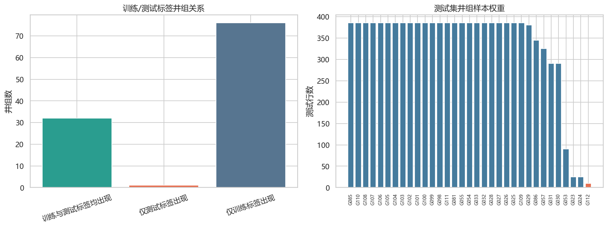
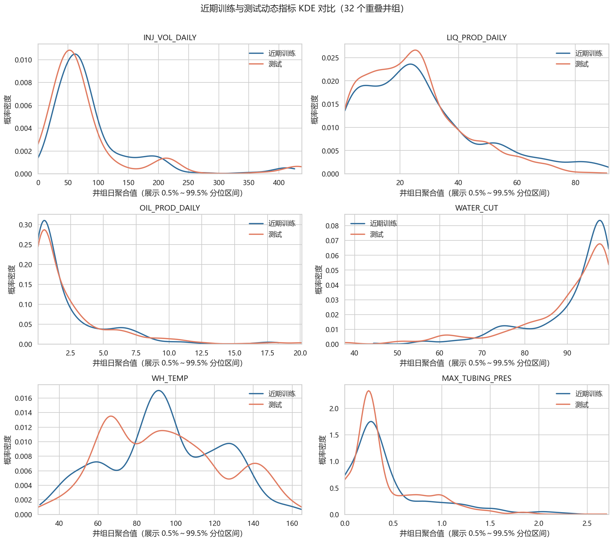
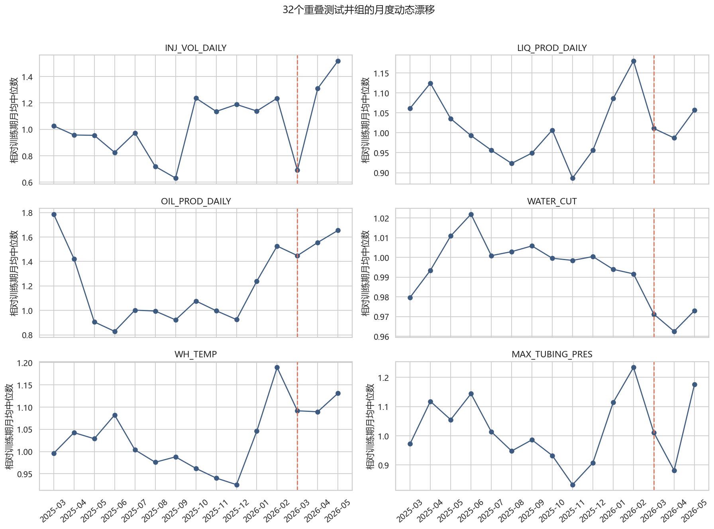

# 时间漂移与训练/测试关系 EDA

## 井组关系

- 训练标签井组：108 个。
- 测试标签井组：33 个。
- 训练测试重叠：32 个。
- 测试新井组：G112。
- 新井组在测试模板中仅 10 行，占 0.09%。

完整测试权重：[`tables/test_group_weights.csv`](tables/test_group_weights.csv)。

## 近期训练与测试动态漂移

为了减少井组构成差异，本节只比较 32 个训练测试重叠井组。近期训练定义为 2026-01-01～2026-02-28，测试为 2026-03-01～2026-05-31，并先按井组日做业务默认聚合。

| 字段            |   近期训练非空数 |   测试非空数 |   近期训练均值 |   测试均值 |   均值变化率 |   近期训练缺失率 |   测试缺失率 |   缺失率变化 |   KS统计量 |   标准化Wasserstein |
|:----------------|-----------------:|-------------:|---------------:|-----------:|-------------:|-----------------:|-------------:|-------------:|-----------:|--------------------:|
| INJ_VOL_DAILY   |             1423 |         1375 |         90.771 |     89.109 |       -0.018 |            0.246 |        0.533 |        0.287 |      0.166 |               0.210 |
| LIQ_PROD_DAILY  |             1547 |         2586 |         27.571 |     24.859 |       -0.098 |            0.181 |        0.122 |       -0.059 |      0.074 |               0.145 |
| OIL_PROD_DAILY  |             1547 |         2586 |          2.291 |      2.589 |        0.130 |            0.181 |        0.122 |       -0.059 |      0.064 |               0.091 |
| WATER_CUT       |             1547 |         2586 |         91.204 |     89.017 |       -0.024 |            0.181 |        0.122 |       -0.059 |      0.106 |               0.221 |
| WH_TEMP         |             1547 |         2586 |         94.844 |     94.129 |       -0.008 |            0.181 |        0.122 |       -0.059 |      0.102 |               0.149 |
| MAX_TUBING_PRES |             1796 |         2897 |          0.487 |      0.424 |       -0.129 |            0.049 |        0.016 |       -0.033 |      0.083 |               0.148 |

KS 统计量和标准化 Wasserstein 距离越大，数值分布变化越明显；缺失率变化为正表示测试更缺失。这些是漂移筛查指标，不直接说明因果。

### KDE 分布形状对比

KDE 使用各指标的非缺失井组日聚合值，曲线面积分别归一化，因此用于比较分布位置、离散程度和多峰结构，不代表样本量。为防止极端值压缩主体曲线，横轴仅展示近期训练与测试合并样本的 0.5%～99.5% 分位区间。缺失率变化仍应结合上一张图判断。

从曲线形状看，井口温度的多峰结构变化最明显；测试期产液量在 20～30 附近更集中，高产液尾部减弱；最大套管压力更集中在低值区；注汽量主体峰略向低值移动。产油量和含水率整体轮廓较接近，但局部密度仍有变化。以上结论只描述非缺失样本，不能替代缺失机制分析。

## 月度动态轨迹

## 标签日期和原始记录覆盖

| split   | 来源   |   目标井组日数 |   同日有原始记录数 |   同日覆盖率 |
|:--------|:-------|---------------:|-------------------:|-------------:|
| train   | 注汽   |           7525 |               7121 |        0.946 |
| train   | 采出   |           7525 |               7525 |        1.000 |
| test    | 注汽   |           2204 |               2175 |        0.987 |
| test    | 采出   |           2204 |               2204 |        1.000 |

测试模板日期范围为 2026-03-01～2026-05-31，但只出现 77 个日期。范围内没有任何测试标签的日期共有 15 天：2026-05-06、2026-05-07、2026-05-08、2026-05-09、2026-05-10、2026-05-11、2026-05-12、2026-05-13、2026-05-14、2026-05-15、2026-05-16、2026-05-17、2026-05-18、2026-05-19、2026-05-24。

## 结论

1. 任务主体是已知井组的未来外推，而不是大规模 cold-start。
2. 动态数值和缺失模式存在时间漂移，不能只用全训练均值做归一化。
3. 测试期初特征必须承接训练期末历史。
4. 标签模板决定预测范围。动态表包含的其他井组不能自动扩展为提交样本。
