# 浅层超稠油注采响应滞后赛题 EDA 总报告

## 1. 报告目标与分析范围

本报告汇总训练集和测试集四类数据表的完整探索性数据分析，围绕以下三个核心问题展开：

1. 一个监督样本由哪些历史信息、静态信息和指标条件共同决定。
2. 多注汽井、多生产井的井组时序应采用什么聚合口径。
3. 从训练历史预测未来测试期时，标签、数值分布和缺失机制会发生什么变化。

分析覆盖井组拓扑、逐井有效天数、时间间隔、缺失与零值、标签完整分布、指标对差异、井组效应、标签时间自相关、简单参照规则的官方评分诊断、候选聚合方式、因果历史互相关窗口以及训练测试漂移。评分诊断没有训练模型，也没有生成测试集预测。

本报告属于 EDA，不包含正式模型训练、测试标签预测或提交文件生成。

### 1.1 数据范围

| 数据部分 | 训练集 | 测试集 |
| --- | ---: | ---: |
| 井组静态关系 | 540 行 | 540 行 |
| 注汽动态 | 56,280 行 | 4,408 行 |
| 采出动态 | 80,443 行 | 14,996 行 |
| 标签/预测模板 | 37,625 行 | 11,020 行 |
| 标签井组数 | 108 | 33 |
| 标签日期范围 | 2025-03-20～2026-02-28 | 2026-03-01～2026-05-31 |

### 1.2 核心判断

| 核心问题 | EDA 结论 |
| --- | --- |
| 样本由什么决定 | 标签键为井组×日期×注入指标×采出指标。当前标签只有 1 个注入指标和 5 个采出指标；历史动态、井组拓扑、缺失状态和指标类别均可能影响 lag。 |
| 时序如何聚合 | 绝大多数井组是单生产井、多注汽井。注汽量、产液和产油以求和为主；含水率采用加权或由液油量推导；温度和压力保留均值、最大值与离散度。 |
| 未来分布如何变化 | 33 个测试井组中 32 个在训练标签中出现，但动态数值和缺失率仍发生漂移。测试期初必须承接训练期末历史。 |
| 记忆题还是 lag 估计题 | `group × indicator` 存在先验，局部标签自相关很强；但严格多步外推和朴素互相关表现有限，因此属于井组先验与时变 lag 信号并存的混合问题。 |

### 1.3 最重要的量化发现

- 112 个静态井组中，109 个只有 1 口生产井，只有 3 个为多生产井；每组注汽井为 1～8 口。
- 日注汽量非空相邻记录中，98.92% 为连续 1 天记录，82.69% 的相邻数值完全相同，不符合严格的“只在状态变化时记录”模式。
- 短滞后样本占 47.36%。3 天有 4,863 条，而 4 天只有 29 条，评分断点两侧高度不连续。
- `group × indicator` 的描述性方差解释比例为 20.6%，但同一组合内 lag 标准差中位数仍为 14.62 天。
- 使用上一真实标签的一步诊断得分约为 76.15；固定在 1 月底向 2 月整段外推的“最后历史标签”简单规则只有约 47.34。两者都只是 EDA 诊断，不是正式模型。
- 朴素互相关最佳描述性配置得分约为 42.81，不能直接复现官方标签。
- 测试新井组 `G112` 只有 10 行，占测试模板约 0.09%。

---

## 2. 井组结构与数据关系

### 结论

- 静态主表有 **112 个井组、384 口唯一井、540 条井组—井关系**。
- 井组关系中有 **425 条注汽井关系**、**115 条生产井关系**。平均每组 3.79 口注汽井、1.03 口生产井。
- 生产侧拓扑很简单：109 个井组为单生产井，只有 3 个井组为多生产井；生产井数最大为 2。注汽侧更复杂，注汽井数范围为 1～8。
- 153 口井关联多个井组，最多关联 3 个井组。不能按物理井名全局去重。
- 训练和测试的 `well_group_info.csv` 完全一致：**True**。`CANTON` 是常量；`ORG_NAME` 与 `BLOCK` 只有两个完全对应的组合；静态 `PROD_DATE` 全部为 2026-01-11，不具备横截面区分度。

### 图表

### 拓扑组合频数

| 拓扑   |   井组数 |
|:-------|---------:|
| 1I-1P  |       22 |
| 2I-1P  |       21 |
| 4I-1P  |       20 |
| 6I-1P  |       16 |
| 5I-1P  |       11 |
| 8I-1P  |        8 |
| 7I-1P  |        6 |
| 3I-1P  |        5 |
| 4I-2P  |        1 |
| 2I-2P  |        1 |

### 文件级结构审计

| 数据集   | 文件                      |   行数 |   列数 |   完全重复行 |   唯一WELL_GROUP_NAME |   唯一WELL_NAME |   唯一PROD_DATE |
|:---------|:--------------------------|-------:|-------:|-------------:|----------------------:|----------------:|----------------:|
| train    | well_group_info.csv       |    540 |     10 |            0 |                   112 |         384.000 |               1 |
| train    | well_inj_data.csv         |  56280 |      7 |            0 |                   108 |         237.000 |             365 |
| train    | well_prod_data.csv        |  80443 |      8 |            0 |                   112 |         242.000 |             363 |
| train    | optimal_lag_days.csv      |  37625 |      5 |            0 |                   108 |         nan     |             223 |
| test     | well_group_info.csv       |    540 |     10 |            0 |                   112 |         384.000 |               1 |
| test     | well_inj_data.csv         |   4408 |      7 |            0 |                    42 |          32.000 |              92 |
| test     | well_prod_data.csv        |  14996 |      8 |            0 |                   112 |         138.000 |              92 |
| test     | test_optimal_lag_days.csv |  11020 |      5 |            0 |                    33 |         nan     |              77 |

### 对后续特征工程的约束

1. 绝大多数井组属于“一口生产井 + 多口注汽井”，生产侧总量与单井量在多数井组接近，但仍要保留多生产井的聚合口径。
2. 注汽侧必须保留总量、最大单井量、井间离散度和有效井数，仅取均值会丢失井组规模。
3. `WELL_PURPOSE` 与动态文件并非完全一致，可能与转驱或历史用途有关，不应仅凭静态用途硬过滤动态记录。
4. 静态年龄与标签图只表示相关关系。年龄与井组、区块、开发阶段共同变化，不能直接解释为因果。

---

## 3. 注汽时序、缺失与零值

### 结论

- 训练注汽表 56,280 行，日期 2025-03-01～2026-02-28；测试注汽表 4,408 行，日期 2026-03-01～2026-05-31。
- `INJ_LIQ_DAILY` 在训练和测试中均 **100% 缺失**，当前数据版本不能作为数值特征。
- `INJ_VOL_DAILY` 的行级缺失率分别为 57.82% 和 55.33%；空值与真实 0 同时存在，不能合并。
- 注汽侧 `WH_TEMP` 的缺失率由 24.91% 升至 54.99%，缺失机制本身存在明显时间漂移。
- 日注汽量的非空相邻记录中，训练集 98.92% 为连续 1 天记录，且 82.69% 的相邻数值完全相同。这与“只在数值变化时才记录”的严格状态变更表不一致。
- 因而仅凭“表中有空值” **不能单独支持** 全量无限制 forward-fill。建议保留原始缺失版，并把有限期 ffill 作为单独候选特征通过时间验证判断。

### 缺失与零值

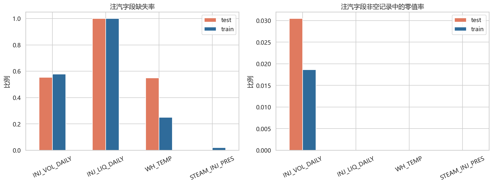

| split   | 字段           |   缺失数 |   缺失率 |   零值数 |   零值率_非空 |    均值 |   中位数 |
|:--------|:---------------|---------:|---------:|---------:|--------------:|--------:|---------:|
| train   | INJ_VOL_DAILY  |    32541 |    0.578 |      442 |         0.019 |  53.848 |   50.000 |
| train   | INJ_LIQ_DAILY  |    56280 |    1.000 |        0 |         0.000 | nan     |  nan     |
| train   | WH_TEMP        |    14020 |    0.249 |        0 |         0.000 | 235.620 |  230.000 |
| train   | STEAM_INJ_PRES |     1079 |    0.019 |        0 |         0.000 |   5.437 |    5.260 |
| test    | INJ_VOL_DAILY  |     2439 |    0.553 |       60 |         0.030 |  75.757 |   60.000 |
| test    | INJ_LIQ_DAILY  |     4408 |    1.000 |        0 |         0.000 | nan     |  nan     |
| test    | WH_TEMP        |     2424 |    0.550 |        0 |         0.000 | 241.721 |  236.000 |
| test    | STEAM_INJ_PRES |        1 |    0.000 |        0 |         0.000 |   6.344 |    5.970 |

### 时间间隔

| split   | 序列          |   间隔数 |   中位间隔 |   P90间隔 |   1天占比 |   2天占比 |   7天占比 |   30天占比 |   >1天占比 |
|:--------|:--------------|---------:|-----------:|----------:|----------:|----------:|----------:|-----------:|-----------:|
| train   | INJ_VOL_DAILY |    23518 |      1.000 |     1.000 |     0.989 |     0.000 |     0.000 |      0.000 |      0.011 |
| test    | INJ_VOL_DAILY |     1921 |      1.000 |     1.000 |     0.985 |     0.004 |     0.002 |      0.001 |      0.015 |

注汽量的相邻有效记录统计：

| split   |   有效相邻对 |   数值完全相同率 |   中位间隔 |   大于1天间隔占比 |
|:--------|-------------:|-----------------:|-----------:|------------------:|
| train   |        23518 |            0.827 |      1.000 |             0.011 |
| test    |         1921 |            0.809 |      1.000 |             0.015 |

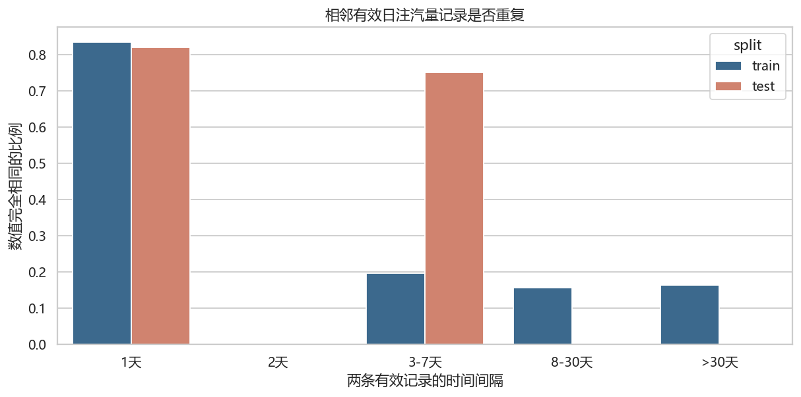

如果这是严格的“只在状态变化时记录”数据，相邻已记录数值应很少完全相同。图中重复率可以检验该假设；实际结果应结合 `gap` 分组看，不能只凭整体非日频就认定 forward-fill 正确。

### 月度缺失模式

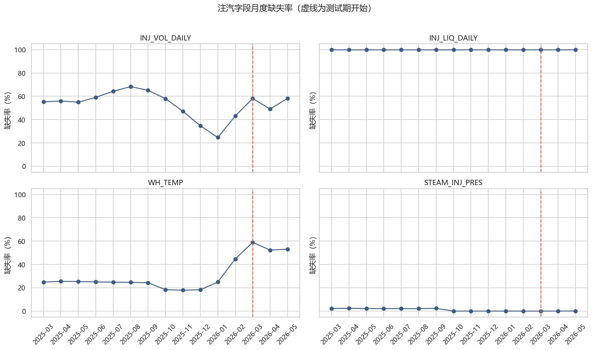

### 按井和井组的有效天数/缺失模式

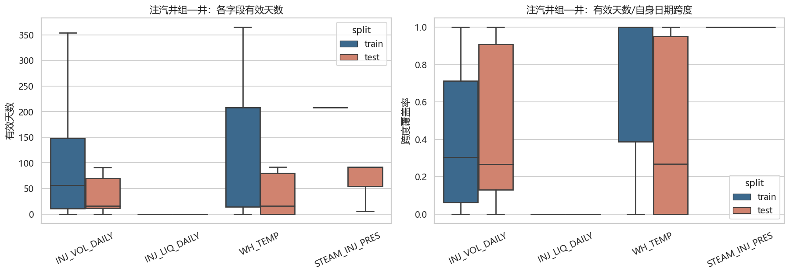

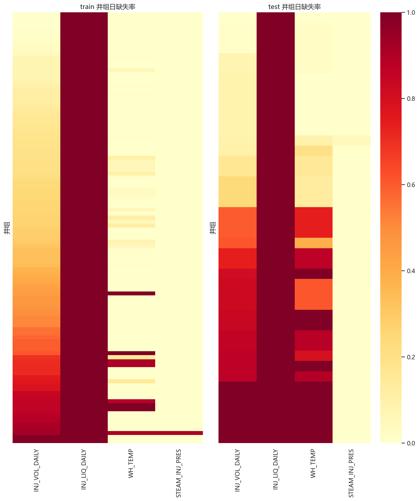

### 建模约束

- 至少同时保留原始缺失标志、距上次有效观测天数、窗口有效率和有限期前向填充值。
- 对 0 单独构造停注/低注状态，不用 `fillna(0)` 覆盖缺失。
- 测试期初的历史窗口应接续训练动态数据；否则 3 月初无法构造 45 天历史。

---

## 4. 采出时序、缺失与内部一致性

### 结论

- 训练采出表 80,443 行，测试采出表 14,996 行。
- 日产液、日产油、含水率和采出侧温度常以同一缺失块出现。训练行级缺失率约 41.5%，测试约 31.8%；油管压力更完整。
- 生产记录总体比注汽量有效记录更接近日频，但仍必须在“井组—井”层面检查间隔，不能只看全表每天是否有记录。
- `WATER_CUT` 与由 `LIQ_PROD_DAILY`、`OIL_PROD_DAILY` 推导的含水率高度一致程度见下表。多生产井聚合时，按产液量加权或从汇总液油量推导，比简单平均更符合比例口径。

### 缺失与零值

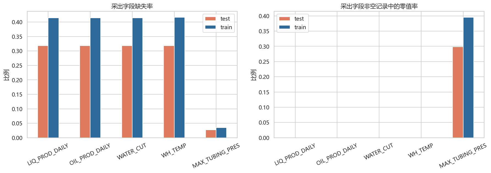

| split   | 字段            |   缺失数 |   缺失率 |   零值数 |   零值率_非空 |    均值 |   中位数 |
|:--------|:----------------|---------:|---------:|---------:|--------------:|--------:|---------:|
| train   | LIQ_PROD_DAILY  |    33357 |    0.415 |        2 |         0.000 |  28.435 |   22.600 |
| train   | OIL_PROD_DAILY  |    33359 |    0.415 |        3 |         0.000 |   4.991 |    1.610 |
| train   | WATER_CUT       |    33359 |    0.415 |        0 |         0.000 |  84.493 |   90.400 |
| train   | WH_TEMP         |    33523 |    0.417 |        0 |         0.000 |  90.906 |   90.000 |
| train   | MAX_TUBING_PRES |     2808 |    0.035 |    30720 |         0.396 |   0.243 |    0.190 |
| test    | LIQ_PROD_DAILY  |     4767 |    0.318 |        0 |         0.000 |  29.575 |   24.400 |
| test    | OIL_PROD_DAILY  |     4767 |    0.318 |        0 |         0.000 |   5.715 |    2.320 |
| test    | WATER_CUT       |     4767 |    0.318 |        0 |         0.000 |  83.003 |   88.000 |
| test    | WH_TEMP         |     4767 |    0.318 |        0 |         0.000 | 104.386 |  108.000 |
| test    | MAX_TUBING_PRES |      404 |    0.027 |     4363 |         0.299 |   0.284 |    0.250 |

### 时间间隔

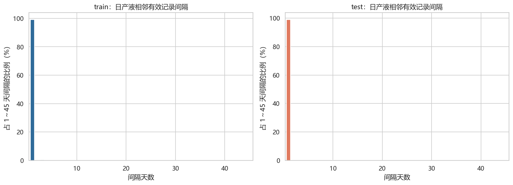

| split   | 序列           |   间隔数 |   中位间隔 |   P90间隔 |   1天占比 |   2天占比 |   7天占比 |   30天占比 |   >1天占比 |
|:--------|:---------------|---------:|-----------:|----------:|----------:|----------:|----------:|-----------:|-----------:|
| train   | LIQ_PROD_DAILY |    46914 |      1.000 |     1.000 |     0.992 |     0.001 |     0.000 |      0.000 |      0.008 |
| test    | LIQ_PROD_DAILY |    10103 |      1.000 |     1.000 |     0.991 |     0.001 |     0.000 |      0.000 |      0.009 |

### 月度缺失模式

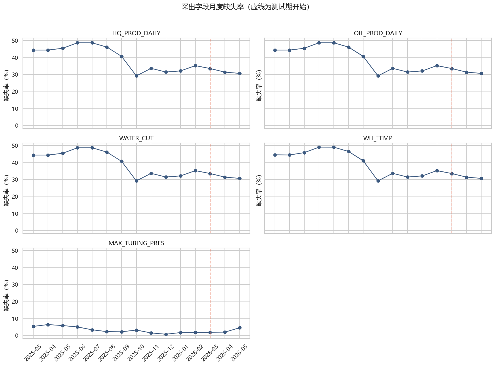

### 含水率一致性

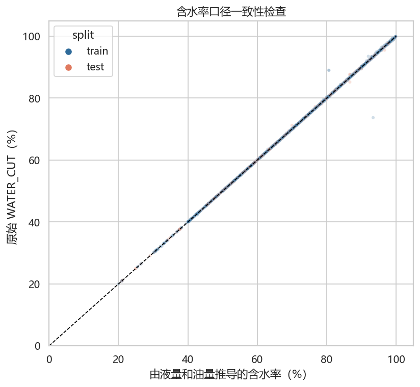

| split   |   样本数 |   相关系数 |   MAE |   中位绝对误差 |   P95绝对误差 |
|:--------|---------:|-----------:|------:|---------------:|--------------:|
| test    |    10229 |      1.000 | 0.033 |          0.009 |         0.142 |
| train   |    47084 |      1.000 | 0.029 |          0.010 |         0.100 |

### 按井和井组的有效天数/缺失模式

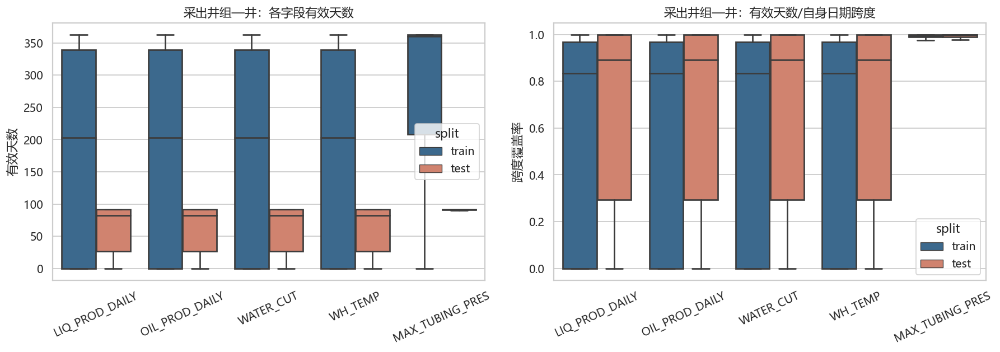

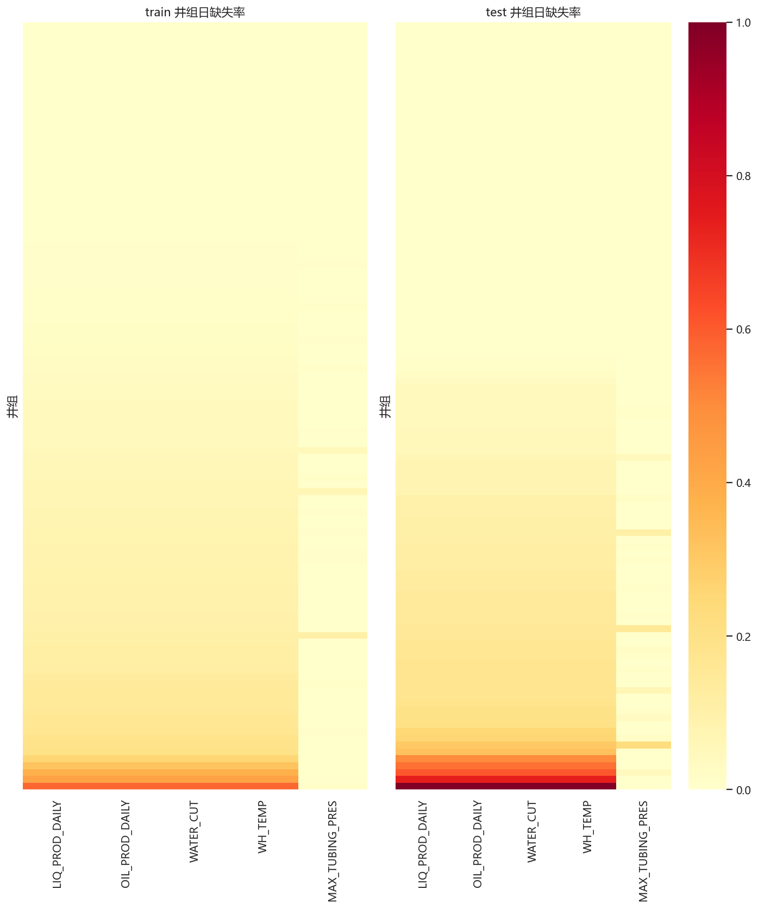

### 建模约束

- 产液和产油优先保留井组求和及井级分布特征。
- 含水率保留原始加权值、由汇总液油量推导值及二者残差。
- 温度用均值、最大值、升温幅度和井间极差；不使用求和作为物理主口径。
- `WH_TEMP` 在注汽表和采出表重名，合并前必须改名。

---

## 5. 标签、指标对与井组效应

### 总体标签分布

- 训练样本 37,625 条，lag 范围 0～45。
- `P(y≤3)` = **47.36%**，`P(y≥4)` = **52.64%**。
- 3 天有 4,863 条，4 天只有 29 条。3/4 分界两侧极不连续。
- 0 天占 23.02%；44/45 天合计占 6.03%。标签存在明显边界聚集。

### 指标对

标签中实际只有 **1 个注入指标**、**5 个采出指标**，总计 5 个固定指标对，不是理论上的 4×5=20 组合。

| INJ_INDICATOR   | PROD_INDICATOR   |   样本数 |   short比例 |   平均lag |   中位lag |   lag众数 |   lag标准差 |
|:----------------|:-----------------|---------:|------------:|----------:|----------:|----------:|------------:|
| INJ_VOL_DAILY   | LIQ_PROD_DAILY   |     7525 |       0.490 |    14.986 |     6.000 |         0 |      16.048 |
| INJ_VOL_DAILY   | MAX_TUBING_PRES  |     7525 |       0.517 |    13.917 |     3.000 |         0 |      15.784 |
| INJ_VOL_DAILY   | OIL_PROD_DAILY   |     7525 |       0.449 |    16.380 |    12.000 |         0 |      15.958 |
| INJ_VOL_DAILY   | WATER_CUT        |     7525 |       0.436 |    16.053 |    10.000 |         0 |      15.849 |
| INJ_VOL_DAILY   | WH_TEMP          |     7525 |       0.477 |    15.485 |     6.000 |         0 |      16.614 |

### 井组条件标签

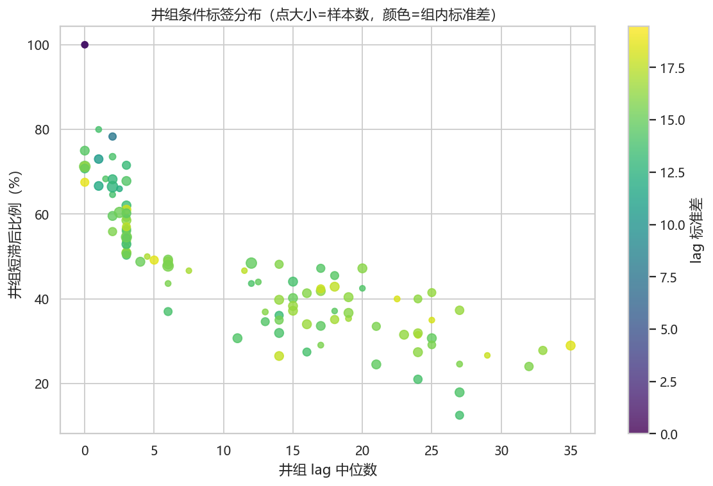

短滞后比例最低与最高的井组：

| WELL_GROUP_NAME   |   样本数 |   平均lag |   中位lag |   short比例 |   label标准差 |
|:------------------|---------:|----------:|----------:|------------:|--------------:|
| G031              |      335 |    26.042 |    27.000 |       0.125 |        13.718 |
| G090              |      485 |    23.404 |    27.000 |       0.179 |        14.103 |
| G028              |      390 |    20.128 |    24.000 |       0.210 |        13.904 |
| G071              |      395 |    24.575 |    32.000 |       0.241 |        15.774 |
| G011              |      485 |    21.120 |    21.000 |       0.245 |        14.727 |
| G041              |       65 |    23.123 |    27.000 |       0.246 |        15.699 |
| G081              |      460 |    19.909 |    14.000 |       0.265 |        17.713 |
| G094              |       30 |    23.467 |    29.000 |       0.267 |        17.859 |
| G051              |       30 |     0.000 |     0.000 |       1.000 |         0.000 |
| G056              |      130 |     0.000 |     0.000 |       1.000 |         0.000 |
| G057              |       85 |     1.059 |     0.000 |       1.000 |         1.322 |
| G049              |       60 |     7.017 |     1.000 |       0.800 |        13.813 |
| G096              |      240 |     4.150 |     2.000 |       0.783 |         7.814 |
| G048              |      460 |     8.254 |     0.000 |       0.750 |        14.401 |
| G067              |      140 |     8.307 |     2.000 |       0.736 |        13.966 |
| G076              |      415 |     5.200 |     1.000 |       0.730 |        10.628 |

### Group effect 与 time-varying effect

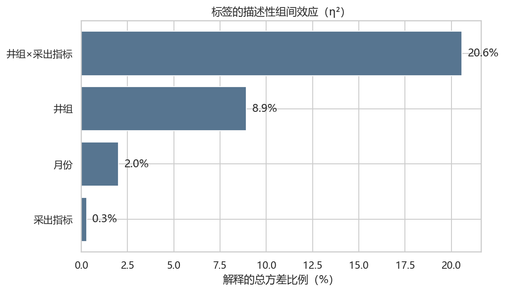

| 分组因素      |   解释方差比例 |
|:--------------|---------------:|
| 井组×采出指标 |          0.206 |
| 井组          |          0.089 |
| 月份          |          0.020 |
| 采出指标      |          0.003 |

同一 `group × indicator` 内部的时间波动：

| 统计项                      |    数值 |
|:----------------------------|--------:|
| group×indicator 组合数      | 540.000 |
| lag标准差中位数             |  14.620 |
| lag标准差P25                |  11.870 |
| lag标准差P75                |  16.872 |
| lag完全不变的组合数         |  13.000 |
| short比例≤10%或≥90%的组合数 |  72.000 |

这组 η² 是描述性方差分解：数值越高，说明类别均值能解释更多总体差异。即使 `井组×指标` 有明显解释力，组内标准差和后续时间图仍显示 lag 会随时间切换，所以本题既不是纯井组记忆题，也不是完全忽略井组的通用时序题。

---

## 6. 标签时间行为、生成频率与简单参照规则

### G081 与代表性时间序列

图中横线是 3/4 天评分断点。可见不同生产指标的状态转换并不同步，不能把同一井组日期的五个标签复制为一个值。

### 标签自相关与状态切换

- 相邻可用标签完全相同率：**70.56%**。
- 相邻标签处于同一短/长分段的比例：**91.48%**。
- 相邻标签绝对变化中位数：0.0 天；均值：3.19 天。

| gap_bucket   |   相邻对数 |   lag完全相同率 |   同分段率 |   中位绝对变化 |   平均绝对变化 |
|:-------------|-----------:|----------------:|-----------:|---------------:|---------------:|
| 1天          |      30325 |           0.774 |      0.949 |          0.000 |          1.948 |
| 2-7天        |       3875 |           0.533 |      0.868 |          0.000 |          5.133 |
| 8-30天       |       2170 |           0.237 |      0.640 |          6.000 |         13.114 |
| >30天        |        715 |           0.176 |      0.540 |         11.000 |         15.450 |

### 标签日期生成频率

- 每个进入标签表的 `group + date` 固定有 **5** 条指标对记录，训练集 7,525 个井组日期全部完整。
- 相邻标签日期的中位间隔为 1 天，但最大间隔达到 158 天，样本并非独立同分布的等间隔观测。

### 月度标签漂移

| 月份    |   样本数 |   井组数 |   short比例 |   平均lag |   中位lag |   lag0比例 |   lag3比例 |   lag44_45比例 |
|:--------|---------:|---------:|------------:|----------:|----------:|-----------:|-----------:|---------------:|
| 2025-03 |      785 |       94 |       0.558 |    12.725 |     3.000 |      0.266 |      0.162 |          0.055 |
| 2025-04 |      730 |       84 |       0.544 |    13.223 |     3.000 |      0.290 |      0.147 |          0.044 |
| 2025-05 |      755 |       87 |       0.438 |    18.139 |    16.000 |      0.213 |      0.150 |          0.110 |
| 2025-06 |      790 |       90 |       0.532 |    12.839 |     3.000 |      0.285 |      0.152 |          0.038 |
| 2025-07 |     8000 |      103 |       0.466 |    15.446 |     6.000 |      0.241 |      0.114 |          0.060 |
| 2025-08 |     7725 |      100 |       0.429 |    17.139 |    14.000 |      0.226 |      0.112 |          0.073 |
| 2025-09 |     7375 |       94 |       0.510 |    14.685 |     3.000 |      0.241 |      0.144 |          0.051 |
| 2025-10 |     1320 |       78 |       0.620 |    10.369 |     3.000 |      0.303 |      0.157 |          0.010 |
| 2025-11 |     1095 |       31 |       0.712 |     7.155 |     1.000 |      0.416 |      0.094 |          0.006 |
| 2025-12 |     1055 |       32 |       0.578 |    11.938 |     3.000 |      0.264 |      0.182 |          0.028 |
| 2026-01 |     3740 |       30 |       0.363 |    17.993 |    14.000 |      0.158 |      0.108 |          0.086 |
| 2026-02 |     4255 |       31 |       0.440 |    16.198 |    12.000 |      0.159 |      0.155 |          0.070 |

### 用官方公式评价 EDA 简单参照规则

> **范围说明：** 本节没有训练任何机器学习模型，也没有预测正式测试集。这里计算的是几条最简单的统计规则，用来判断标签仅靠总体分布、井组记忆或时间持续性能达到什么水平。它们属于 EDA 的可预测性诊断，不是正式模型基线，更不是比赛提交结果。“上一时刻真实标签”还使用了验证期真实值，只代表局部自相关的诊断上限，线上无法使用。

2026 年 2 月多步时间外推结果：

| 预测规则                         |   样本数 |   分段准确率 |   S_seg |   MAE_short |   S_short |   MAE_long |   S_long |   总分 |
|:---------------------------------|---------:|-------------:|--------:|------------:|----------:|-----------:|---------:|-------:|
| 井组历史中位数                   |     4255 |        0.501 |  30.078 |       9.326 |     0.000 |     18.886 |    6.223 | 36.300 |
| 指标对历史中位数                 |     4255 |        0.516 |  30.980 |       5.626 |     0.000 |     21.290 |    5.742 | 36.722 |
| 固定全局中位数                   |     4255 |        0.560 |  33.603 |       4.499 |     0.000 |     21.760 |    5.648 | 39.251 |
| 井组×指标历史中位数              |     4255 |        0.585 |  35.126 |       9.841 |     0.000 |     17.359 |    6.528 | 41.654 |
| 截止1月底最后标签                |     4255 |        0.676 |  40.541 |       8.127 |     0.000 |     16.021 |    6.796 | 47.336 |
| 上一时刻真实标签（不可线上使用） |     4255 |        0.928 |  55.657 |       2.098 |    11.120 |      3.157 |    9.369 | 76.146 |

“上一时刻真实标签”使用了验证期内已经发生的真实标签，只是局部持续性的诊断上限，测试时不可用。正式验证应固定在预测起点，只使用起点以前的标签和动态数据做完整多步外推。

---

## 7. 井组聚合方式与滞后互相关

### 聚合方式比较

| 方案               |   有效覆盖率 |   有效样本MAE |   有效样本分段准确率 |   有效样本官方分 |   缺失回退后官方分 |
|:-------------------|-------------:|--------------:|---------------------:|-----------------:|-------------------:|
| 业务默认混合聚合   |        0.875 |        14.593 |                0.613 |           44.217 |             42.806 |
| 仅改变注汽量为sum  |        0.875 |        14.593 |                0.613 |           44.217 |             42.806 |
| 全部采出指标用mean |        0.875 |        14.688 |                0.612 |           44.102 |             42.704 |
| 仅改变注汽量为mean |        0.875 |        15.059 |                0.611 |           44.050 |             42.658 |
| 全部采出指标用max  |        0.875 |        14.708 |                0.610 |           43.999 |             42.614 |
| 仅改变注汽量为min  |        0.875 |        15.297 |                0.610 |           43.941 |             42.561 |
| 仅改变注汽量为max  |        0.874 |        15.047 |                0.608 |           43.803 |             42.430 |
| 全部采出指标用sum  |        0.875 |        14.870 |                0.606 |           43.709 |             42.359 |
| 全部采出指标用min  |        0.800 |        15.476 |                0.597 |           43.114 |             41.221 |

图表比较 `sum / mean / max / min / std` 在井组日层面的缺失和波动。物理主口径建议为：

- 注汽量：sum 为主，同时保留 max、mean、std 和有效井数。
- 产液、产油：sum 为主。
- 含水率：产液加权或由汇总液油量推导。
- 温度：mean/max/极差，不用 sum 作为主量。
- 压力：max 与 mean 都应验证；当前互相关默认使用井组 max。

### 因果历史窗口互相关实验

对每条训练标签，使用截止该日期的历史窗口，计算 0～45 天候选滞后。比较了：

- 原始值最大正相关。
- 原始值最大绝对相关。
- 一阶差分最大绝对相关。
- 对称变化率最大绝对相关。
- 注汽量最长 45 天有限 forward-fill 后的原始值绝对相关。
- 15、30、60、90、180 天历史窗口。

所有相关都要求窗口内至少 5 个、且不少于窗口一半的有效配对点。无有效候选时，完整评分使用相应采出指标的训练中位 lag 回退。这是标签机制探测实验，不是无泄漏模型验证，因为回退值和配置比较使用了全训练标签。

得分最高的描述性配置是 `raw_abs_injffill_W90`：有效覆盖率 87.47%，有效样本 MAE 14.59 天，回退后官方分 42.81。

前 15 个配置：

| 配置                 |   窗口 | 序列   | 取绝对相关   | 注汽前向填充   |   有效覆盖率 |   Spearman |   有效样本MAE |   有效样本分段准确率 |   有效样本官方分 |   缺失回退后官方分 |
|:---------------------|-------:|:-------|:-------------|:---------------|-------------:|-----------:|--------------:|---------------------:|-----------------:|-------------------:|
| raw_abs_injffill_W90 |     90 | raw    | True         | True           |        0.875 |      0.208 |        14.593 |                0.613 |           44.217 |             42.806 |
| raw_abs_injffill_W60 |     60 | raw    | True         | True           |        0.890 |      0.185 |        14.789 |                0.595 |           43.411 |             41.952 |
| raw_abs_W60          |     60 | raw    | True         | False          |        0.739 |      0.149 |        15.535 |                0.582 |           42.352 |             40.559 |
| raw_abs_injffill_W30 |     30 | raw    | True         | True           |        0.844 |      0.123 |        16.864 |                0.579 |           42.013 |             40.501 |
| raw_abs_W90          |     90 | raw    | True         | False          |        0.694 |      0.124 |        15.961 |                0.592 |           42.791 |             40.406 |
| raw_abs_W30          |     30 | raw    | True         | False          |        0.767 |      0.121 |        16.955 |                0.574 |           41.674 |             40.042 |
| raw_signed_W90       |     90 | raw    | False        | False          |        0.694 |      0.078 |        17.186 |                0.585 |           41.985 |             39.822 |
| raw_signed_W60       |     60 | raw    | False        | False          |        0.739 |      0.063 |        17.124 |                0.569 |           41.177 |             39.666 |
| raw_abs_injffill_W15 |     15 | raw    | True         | True           |        0.784 |      0.092 |        17.605 |                0.560 |           40.753 |             39.570 |
| rate_abs_W30         |     30 | rate   | True         | False          |        0.739 |      0.077 |        17.465 |                0.571 |           41.364 |             39.560 |
| diff_abs_W60         |     60 | diff   | True         | False          |        0.724 |      0.064 |        16.965 |                0.570 |           41.229 |             39.500 |
| diff_abs_W30         |     30 | diff   | True         | False          |        0.739 |      0.079 |        17.331 |                0.569 |           41.262 |             39.486 |
| rate_abs_W60         |     60 | rate   | True         | False          |        0.724 |      0.060 |        17.247 |                0.567 |           41.089 |             39.399 |
| raw_abs_W15          |     15 | raw    | True         | False          |        0.746 |      0.088 |        17.573 |                0.556 |           40.482 |             39.387 |
| raw_signed_W30       |     30 | raw    | False        | False          |        0.767 |      0.086 |        17.281 |                0.558 |           40.614 |             39.226 |

### 结论

如果互相关候选 lag 与标签高度一致，应出现较低 MAE、较高分段准确率和接近对角线的诊断图。当前结果显示，单一朴素互相关规则只能解释部分标签；窗口、变换和缺失口径会显著改变结果。互相关更适合作为候选 lag、峰值强度、峰间距和稳定性特征，再交给评分对齐的监督模型校准，而不是直接作为最终预测。

---

## 8. 时间漂移与训练测试关系

### 井组关系

- 训练标签井组：108 个。
- 测试标签井组：33 个。
- 训练测试重叠：32 个。
- 测试新井组：G112。
- 新井组在测试模板中仅 10 行，占 0.09%。

### 近期训练与测试动态漂移

为了减少井组构成差异，本节只比较 32 个训练测试重叠井组。近期训练定义为 2026-01-01～2026-02-28，测试为 2026-03-01～2026-05-31，并先按井组日做业务默认聚合。

| 字段            |   近期训练非空数 |   测试非空数 |   近期训练均值 |   测试均值 |   均值变化率 |   近期训练缺失率 |   测试缺失率 |   缺失率变化 |   KS统计量 |   标准化Wasserstein |
|:----------------|-----------------:|-------------:|---------------:|-----------:|-------------:|-----------------:|-------------:|-------------:|-----------:|--------------------:|
| INJ_VOL_DAILY   |             1423 |         1375 |         90.771 |     89.109 |       -0.018 |            0.246 |        0.533 |        0.287 |      0.166 |               0.210 |
| LIQ_PROD_DAILY  |             1547 |         2586 |         27.571 |     24.859 |       -0.098 |            0.181 |        0.122 |       -0.059 |      0.074 |               0.145 |
| OIL_PROD_DAILY  |             1547 |         2586 |          2.291 |      2.589 |        0.130 |            0.181 |        0.122 |       -0.059 |      0.064 |               0.091 |
| WATER_CUT       |             1547 |         2586 |         91.204 |     89.017 |       -0.024 |            0.181 |        0.122 |       -0.059 |      0.106 |               0.221 |
| WH_TEMP         |             1547 |         2586 |         94.844 |     94.129 |       -0.008 |            0.181 |        0.122 |       -0.059 |      0.102 |               0.149 |
| MAX_TUBING_PRES |             1796 |         2897 |          0.487 |      0.424 |       -0.129 |            0.049 |        0.016 |       -0.033 |      0.083 |               0.148 |

KS 统计量和标准化 Wasserstein 距离越大，数值分布变化越明显；缺失率变化为正表示测试更缺失。这些是漂移筛查指标，不直接说明因果。

### KDE 分布形状对比

KDE 使用各指标的非缺失井组日聚合值，曲线面积分别归一化，因此用于比较分布位置、离散程度和多峰结构，不代表样本量。为防止极端值压缩主体曲线，横轴仅展示近期训练与测试合并样本的 0.5%～99.5% 分位区间。缺失率变化仍应结合上一张图判断。

从曲线形状看，井口温度的多峰结构变化最明显；测试期产液量在 20～30 附近更集中，高产液尾部减弱；最大套管压力更集中在低值区；注汽量主体峰略向低值移动。产油量和含水率整体轮廓较接近，但局部密度仍有变化。以上结论只描述非缺失样本，不能替代缺失机制分析。

### 月度动态轨迹

### 标签日期和原始记录覆盖

| split   | 来源   |   目标井组日数 |   同日有原始记录数 |   同日覆盖率 |
|:--------|:-------|---------------:|-------------------:|-------------:|
| train   | 注汽   |           7525 |               7121 |        0.946 |
| train   | 采出   |           7525 |               7525 |        1.000 |
| test    | 注汽   |           2204 |               2175 |        0.987 |
| test    | 采出   |           2204 |               2204 |        1.000 |

测试模板日期范围为 2026-03-01～2026-05-31，但只出现 77 个日期。范围内没有任何测试标签的日期共有 15 天：2026-05-06、2026-05-07、2026-05-08、2026-05-09、2026-05-10、2026-05-11、2026-05-12、2026-05-13、2026-05-14、2026-05-15、2026-05-16、2026-05-17、2026-05-18、2026-05-19、2026-05-24。

### 结论

1. 任务主体是已知井组的未来外推，而不是大规模 cold-start。
2. 动态数值和缺失模式存在时间漂移，不能只用全训练均值做归一化。
3. 测试期初特征必须承接训练期末历史。
4. 标签模板决定预测范围。动态表包含的其他井组不能自动扩展为提交样本。

---

## 9. 综合结论与建模约束

### 三个核心问题

| 问题                         | EDA答案                                                                                                                                            |
|:-----------------------------|:---------------------------------------------------------------------------------------------------------------------------------------------------|
| 一个训练样本由哪些信息决定？ | 标签键是井组×日期×注入指标×采出指标；当前只有1个注入指标、5个采出指标。应使用该日期以前的井级/井组级动态、静态拓扑、缺失状态和指标类别。           |
| 井组时序如何聚合？           | 多数为1P+多I。注汽量、产液、产油以sum为主；比例做加权；温压保留mean/max/std；所有指标保留有效井数与缺失特征。                                      |
| 训练与未来测试如何变化？     | 33个测试井组中32个已见，但数值分布和缺失率发生漂移；测试初期需要训练末期历史；新井组仅占约0.09%。                                                  |
| 这是记忆题还是lag估计题？    | group×indicator存在稳定先验，局部标签自相关很强，但多步外推简单规则的得分明显下降，朴素互相关也不能充分复现标签。因此是井组先验与时变lag信号并存的混合问题。 |

### 第一轮必须保留的事实

1. 训练标签共有 37,625 行，严格对应 7,525 个井组日期 × 5 个采出指标。
2. 标签只有 `INJ_VOL_DAILY` 这一个注入指标；不要根据原始注汽字段自行扩展标签组合。
3. 短段占 47.36%，3/4 天边界不连续。评估必须使用官方分数。
4. 井组拓扑以多注汽井、单生产井为主，但同一物理井可属于多个井组。
5. `INJ_LIQ_DAILY` 全空；注汽量空值与零值并存；注汽温度的测试缺失显著增加。
6. 标签局部持续性强，但严格多步时间外推远弱于使用上一真实标签的诊断上限。
7. 指标对、井组和月份都会改变标签分布，不能只训练一个不带类别条件的普通回归器。
8. 朴素互相关只提供部分信号，需要去趋势、差分、峰值稳定性与监督校准。

### 推荐验证约束

- 主验证采用滚动时间切分，最后一个月整段预测，禁止随机行切分。
- 同一 `group + date` 的 5 条记录始终放在同一折。
- 所有历史标签统计、缺失填充参数和归一化参数只用训练折拟合。
- 报告 `S_seg / S_short / S_long / Final`，并按井组、生产指标和月份拆分。
- 额外做井组留出验证，但其权重低于时间外推验证。
